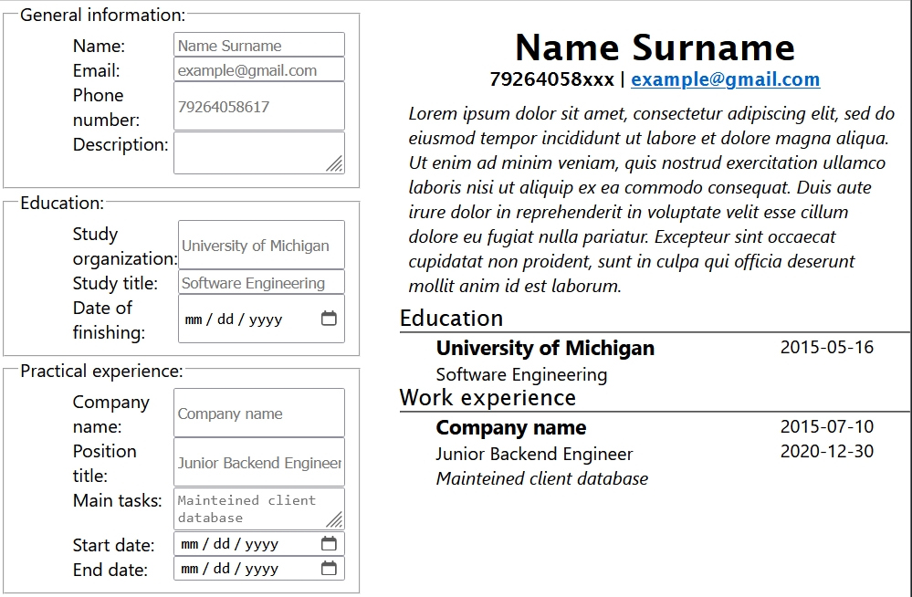

First project made with

<a href="https://reactjs.org/">
  
</a>
<br></br>
<a href="https://de.wikipedia.org/wiki/JavaScript">
  
</a>

<a href="https://en.wikipedia.org/wiki/HTML5">
  
</a>

<a href="https://en.wikipedia.org/wiki/CSS">
  
</a>


# Preview

https://cvcreator.hikyn.dev/



## Encountered problems and their solutions:

It was a lot of work to bind every method inside constructor:

```js
constructor(props) {
    super(props)

    this.handleSchoolNameChange = this.handleSchoolNameChange.bind(this);
    this.handleStudyTitleChange = this.handleStudyTitleChange.bind(this);
    this.handleDateOfStudyChange = this.handleDateOfStudyChange.bind(this);
}
```

For methods like this:

```js
handleSchoolNameChange(e) {
    this.props.setSchoolName(e.target.value);
}
```

To make it less tedious we can write methods like this:

```js
handleSchoolNameChange = (e) => {
  this.props.setSchoolName(e.target.value);
};
```

This way we use [class fields](https://github.com/tc39/proposal-class-fields) to do the binding outside the constructor.

Source: [Ross Allen](https://stackoverflow.com/questions/32192682/react-js-es6-avoid-binding-this-to-every-method)

## What can be added/optimized

- Use class fields instead of binding in constructor
- Add more categories (ex. projects, tech skills)
- Option to choose font
- Pdf extraction

## Available Scripts

In the project directory, you can run:

### `npm start`

Runs the app in the development mode.\
Open [http://localhost:3000](http://localhost:3000) to view it in your browser.

The page will reload when you make changes.\
You may also see any lint errors in the console.

### `npm test`

Launches the test runner in the interactive watch mode.\
See the section about [running tests](https://facebook.github.io/create-react-app/docs/running-tests) for more information.

### `npm run build`

Builds the app for production to the `build` folder.\
It correctly bundles React in production mode and optimizes the build for the best performance.

The build is minified and the filenames include the hashes.\
Your app is ready to be deployed!

See the section about [deployment](https://facebook.github.io/create-react-app/docs/deployment) for more information.

### `npm deploy`

Deploys to gh-pages. Made from this instruction: https://medium.com/@isharamalaviarachchi/how-to-deploy-your-react-app-into-github-pages-b2c96292b18e
